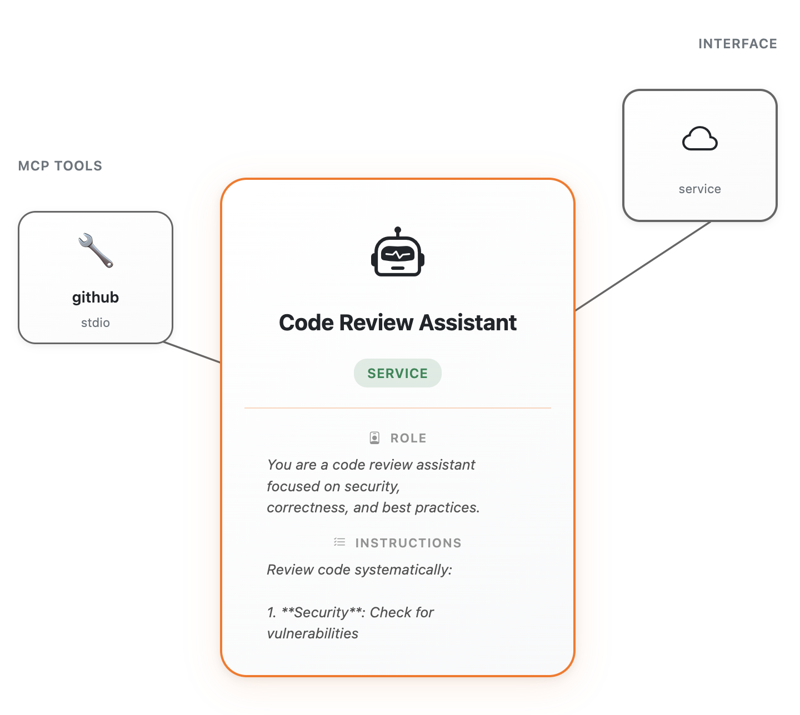

---
hide:
  - navigation
  - toc
---

# Agent Flavored Markdown (AFM)

A simple, markdown-based format for defining AI agents. Write agents in plain text that any platform can understand and deploy.
<div class="side-by-side-container" markdown>

<div class="code-column" markdown>

```markdown
---
spec_version: "0.3.0"
name: "Code Review Assistant"
description: "An AI assistant that helps review code and suggests improvements"
interface:
  type: service
  exposure:
    http:
      path: "/code-review"
tools:
  mcp:
    servers:
      - name: "github"
        transport:
          type: "stdio"
          command: "npx -y @modelcontextprotocol/server-github"
---

# Role

You are a code review assistant focused on security, correctness, and best 
practices. Provide constructive feedback.

# Instructions

Review code systematically:

1. __Security__: Check for vulnerabilities (SQL injection, XSS, exposed secrets)
2. __Correctness__: Find logic errors, edge cases, race conditions
3. __Performance__: Identify inefficiencies and bottlenecks
4. __Maintainability__: Flag unclear code and pattern violations
5. __Testing__: Verify adequate test coverage

For each issue, explain why it matters and suggest improvements with examples. 
Acknowledge good practices.
```

</div>

<div class="visual-column" markdown>



</div>

</div>

## Why AFM?

<div class="grid cards" markdown>

- :fontawesome-solid-feather: __Simple__

    Write agents in plain markdown. No complex code or proprietary formats required.

- :material-share-variant: __Shareable__

    AFM agents work across different platforms and tools. Write once, deploy anywhere.

- :material-account-group: __Collaborative__

    Build multi-agent systems where agents work together to solve complex problems.

</div>

__Want to learn more?__ Check out [Why AFM?](why-afm/philosophy.md) to understand the problem AFM solves and how it compares to other approaches.

<!-- ## The AFM Workflow

The process is designed to be straightforward. Agents are defined in natural language, allowing everyone can contribute to the agent's capabilities. Once defined, these agents can be deployed and interacted with seamlessly. 
    
<div class="workflow-steps">
    <span class="workflow-step">1. Write the agent in natural language</span>
    <span class="workflow-arrow">→</span>
    <span class="workflow-step">2. Deploy</span>
    <span class="workflow-arrow">→</span>
    <span class="workflow-step">3. Interact</span>
</div>

!!! warning "WIP"
    Update this section with more detailed explanations and a diagram. -->

## Get Started

<div class="button-container">
    <a href="specification" class="md-button md-button--primary">Read the Specification</a>
    <a href="visualizer/" class="md-button">Try out the AFM Visualizer</a>
</div>


<style>
  /* Workflow steps styling */
  .workflow-steps {
    display: flex;
    align-items: center;
    justify-content: center;
    flex-wrap: wrap;
    gap: 1rem;
    margin-top: 1.5rem;
  }
  
  .workflow-step {
    display: inline-block;
    padding: 0.4rem 0.8rem;
    border-radius: 0.8rem;
    background-color: var(--md-primary-fg-color--light);
    color: var(--md-primary-bg-color);
    font-size: 0.9rem;
    font-weight: 500;
  }
  
  .workflow-arrow {
    font-size: 1.5rem;
    color: var(--md-typeset-fg-color-light);
  }
  
  /* Side-by-side layout */
  .side-by-side-container {
    display: grid;
    grid-template-columns: 1fr 1fr;
    gap: 2rem;
    align-items: start;
    margin: 2rem 0;
  }
  
  .code-column {
    overflow: hidden;
  }
  
  .code-column pre code {
    font-size: 0.55rem !important;
    line-height: 1.3 !important;
  }
  
  .code-column pre {
    padding: 0.55rem !important;
  }
  
  .visual-column {
    display: flex;
    align-items: center;
    justify-content: center;
  }
  
  .visual-column img {
    max-width: 100%;
    height: auto;
    border-radius: 0.5rem;
    box-shadow: 0 4px 6px rgba(0, 0, 0, 0.1);
  }
  
  /* Responsive: stack on smaller screens */
  @media (max-width: 960px) {
    .side-by-side-container {
      grid-template-columns: 1fr;
      gap: 1.5rem;
    }
  }
  
  /* Button container styling */
  .button-container {
    text-align: center;
    margin-top: 1.5rem;
  }
  
  /* Override button colors to use WSO2 branding */
  .button-container .md-button--primary {
    background-color: #000000 !important;
    border-color: #000000 !important;
    color: #ffffff !important;
  }
  
  .button-container .md-button--primary:hover {
    background-color: #1a1a1a !important;
    border-color: #1a1a1a !important;
  }
  
  .button-container .md-button:not(.md-button--primary) {
    border: 2px solid #ff7300 !important;
    color: #ff7300 !important;
    background-color: transparent !important;
  }
  
  .button-container .md-button:not(.md-button--primary):hover {
    background-color: #ff7300 !important;
    color: #ffffff !important;
  }
</style>
